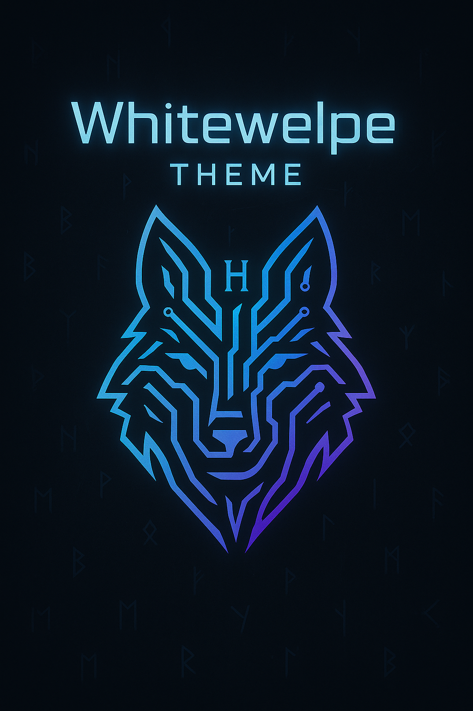

  

<h1 align="center">Whitewelpe Theme</h1>

  Ein elegantes Discord-Theme von <a href="https://whitewelpe.de" target="_blank">Whitewelpe.de</a> 
  erstellt von <strong>Wölfi-Fe</strong>.

---

## 🚀 Installation

1. Lade die Datei [`theme.css`](theme.css) herunter.
2. Importiere sie in BetterDiscord unter "Themes" und aktiviere sie.

---

## 🖼️ Vorschau

  

---

## 📄 Lizenz

Dieses Projekt ist unter der [MIT Lizenz](LICENSE) veröffentlicht.  
Du darfst es frei verwenden, ändern und verbreiten.

---

  Made with 🺠by <a href="https://whitewelpe.de" target="_blank">Whitewelpe.de</a>

